# bare - Pure Assembly Shell



      

Interactive shell written in x86_64 Linux assembly. No libc, no runtime, pure syscalls. Single static binary, roughly 115KB. Every feature is hand-coded with direct kernel interaction.

<br clear="left"/>

## Build

```bash
nasm -f elf64 bare.asm -o bare.o && ld bare.o -o bare
```

## Features

### Prompt and Navigation
- Dynamic prompt: `user@host: ~/cwd (git-branch) >`
- Bookmarks with tags (`:bm`), auto-cd from bookmark and directory names
- Directory history (`:dirs`), pushd/popd
- Ctrl-L clear screen, Ctrl-C clear line

### Command Execution
- Multi-pipe support (up to 16 segments)
- Redirections: `>`, `>>`, `<`
- Command chaining: `;`, `&&`, `||`
- Command substitution: `$(cmd)`
- Background execution with `&`
- Command timing for slow commands

### Expansion
- Brace expansion: `{a,b,c}`
- Tilde expansion: `~`, `~/path`
- Variable expansion: `$VAR`, `${VAR}`, `$?`, `$$`
- Glob expansion: `*`, `?`
- History expansion: `!!`, `!N`, `!-N`

### Aliases and Abbreviations
- Nick aliases: `:nick`
- Global aliases: `:gnick`
- Abbreviations: `:abbrev` (expand on space)

### Line Editing and Completion
- Interactive tab cycling with highlighting (TAB/Shift-TAB)
- Ctrl-R reverse incremental history search
- Inline history suggestions (grayed text, right-arrow to accept)
- Ctrl-G edit current line in `$EDITOR`
- Tab completion for commands (PATH search) and files

### Job Control
- Ctrl-Z suspend foreground process
- `:jobs`, `:fg`, `:bg` builtins

### Themes and Colors
- 6 built-in themes: default, solarized, dracula, gruvbox, nord, monokai
- Switch with `:theme <name>`
- 16 individual color settings via `:config c_<name> <value>`

### Configuration
- Config file: `~/.barerc` (line-based key=value format)
- Auto-saved on exit
- History: `~/.bare_history` with smart deduplication
- Companion TUI config tool: [bareconf](https://github.com/isene/bareconf)

### Plugins

Plugins are executables in `~/.bare/plugins/`. Any unknown colon command runs the matching plugin. Write plugins in any language.

```bash
# Install included plugins
cp plugins/* ~/.bare/plugins/
chmod +x ~/.bare/plugins/*
```

Included plugins:
- `:ask <question>` - ask AI a question (requires OpenAI API key)
- `:suggest <task>` - get a shell command suggestion from AI

See [plugins/README.md](plugins/README.md) for setup and writing your own.

### Other
- Signal handling and TTY detection
- Syntax highlighting (commands, switches, pipe segments)
- Multi-line editing (continuation on `\`, `|`, `&&`, `||`)
- Auto-pairing brackets and quotes
- Auto-correct suggestions on command not found
- Session save/load (`:save_session`, `:load_session`)
- Calculator (`:calc`), command stats (`:stats`)
- Validation rules (`:validate pattern = warn/confirm/block`)
- Prefix history search (type text, press Up to filter)
- Builtins: cd, pwd, exit, export, unset, history, pushd, popd

## Part of CHasm (CHange to ASM)

The same shell, three languages:

| Shell | Language | Suite |
|-------|----------|-------|
| **[bare](https://github.com/isene/bare)** | **x86_64 Assembly** | **CHasm** |
| [rush](https://github.com/isene/rush) | Rust | Fe2O3 |
| [rsh](https://github.com/isene/rsh) | Ruby | |

Companion: [bareconf](https://github.com/isene/bareconf) (TUI configurator, built on [crust](https://github.com/isene/crust))

## License

[Unlicense](https://unlicense.org/) - public domain.

## Credits

Created by Geir Isene (https://isene.org) with extensive pair-programming with Claude Code.
